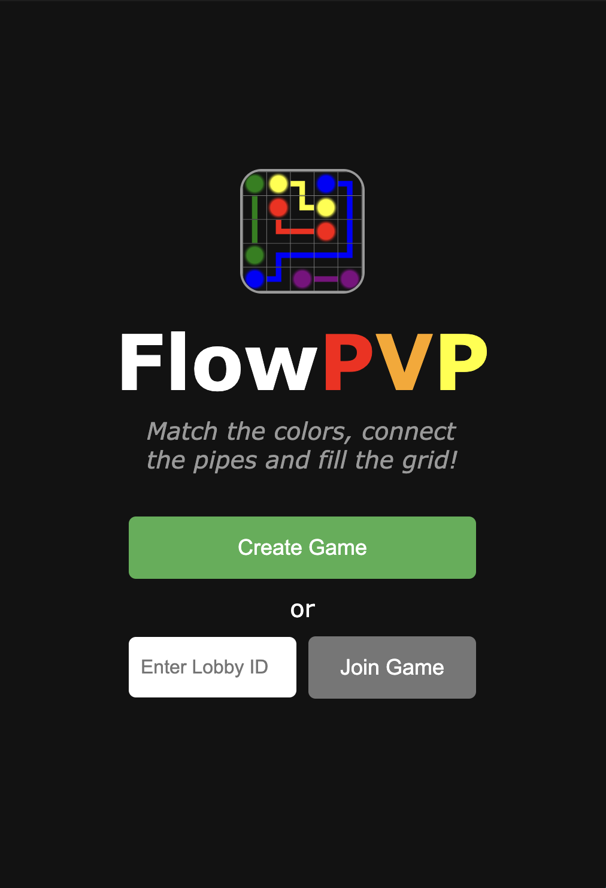
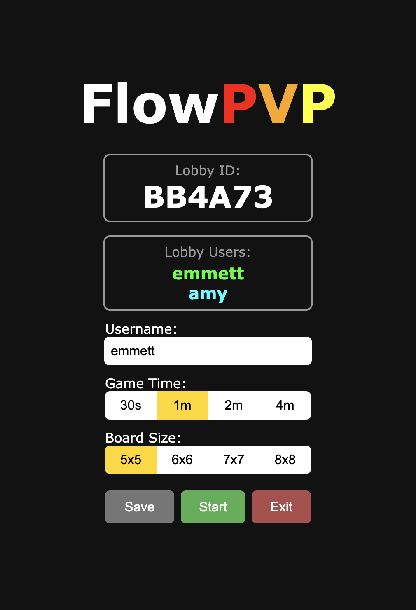
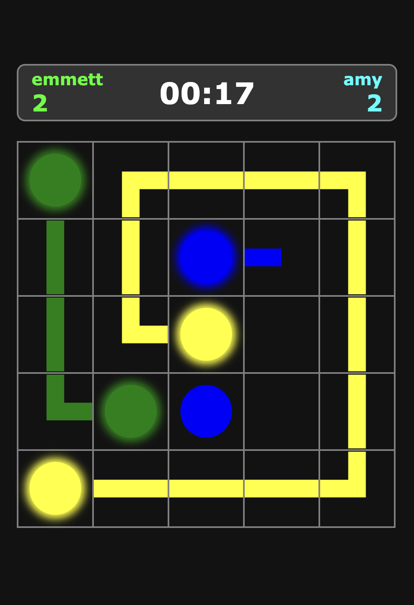

# FlowPVP

[Play Now](https://flow-pvp.web.app/)&nbsp;&nbsp;|&nbsp;&nbsp;<i>Created: Spring 2025 (College Junior)</i>

  
  
  

 
<b>FlowPVP is an online multiplayer web game based off the <a href="https://play.google.com/store/apps/details?id=com.bigduckgames.flow&hl=en_US">Flow Mobile Game</a>. Users compete by solving the most grids in a set amount of time; grids are solved by connecting colored pairs and completely filling the board with pipes.</b>

<b>Main features:</b>
<ul>
  <li>Online multiplayer with 2 players</li>
  <li>Create and join game lobbies</li>
  <li>Board generation using union find and pathfinding algorithms</li>
  <li>Real-time score updates between users</li>
  <li>Customizable games by grid size, time and usernames</li>
</ul>
<b>Tools used:</b>
<ul>
  <li>JavaScript - SolidJS</li>
  <li>Python - Flask</li>
  <li>HTML/CSS</li>
  <li>Render, Firebase</li>
  <li>Socket.IO</li>
</ul>
